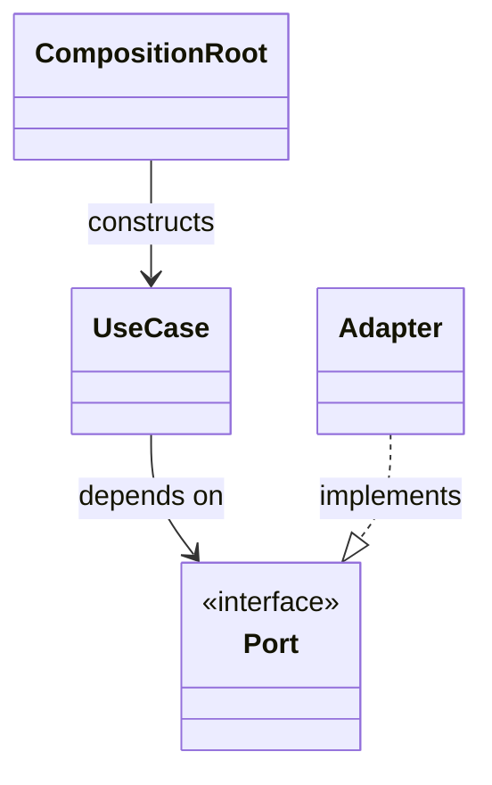

# Project Lifecycle

Use this workflow for changes that are large enough to require architectural or
product decisions before implementation.

## 1. Project Proposal

Create one Markdown project proposal. The proposal must describe:

- the problem and intended outcome;
- confirmed decisions and assumptions;
- affected components and boundaries;
- a Mermaid composition or class graph when the change introduces, removes,
  or rearranges three or more collaborating components, or crosses an
  architectural boundary;
- the proposed runtime or data flow;
- failure handling and user-visible behavior;
- implementation stages;
- tests and acceptance criteria;
- open questions that require a decision.

The proposal has status `PROPOSED`. No production implementation starts during
this stage.

The composition graph is the quick architectural view, not a decorative copy
of the prose. Show the composition root, dependency direction, important
interfaces or ports, their adapters, and ownership of external frameworks.
Keep implementation details out of the graph. Split an unreadable graph into
small focused graphs. If the change does not meet the graph requirement, the
proposal may omit it.

### Diagram Formats

- Use Mermaid for diagrams embedded next to descriptions, instructions,
  project proposals, review notes, and other Markdown documentation. Prefer it
  for compact composition, flow, state, and sequence views that should render
  directly with the surrounding text.
- Use PlantUML for dedicated, durable architecture models, especially when the
  diagram needs detailed UML semantics, packages, members, or layout control.
  Keep the editable PlantUML source in the repository; generate a viewable
  artifact only when the target documentation surface cannot render it.
- Do not maintain equivalent Mermaid and PlantUML sources for the same diagram.
  Choose the format according to the diagram's responsibility so there is one
  source of truth.
- A project proposal may use Mermaid to communicate its planned composition.
  Create or replace it with a durable PlantUML architecture model only when the
  repository owner explicitly requests that outcome. Implementation or
  documentation acceptance alone does not authorize that conversion.

## 2. Proposal Review

The repository owner reviews the project file. Discussion and corrections are
applied to the proposal itself so the accepted design is explicit.

Implementation starts only after the repository owner accepts the proposal.
Change its status to `APPROVED FOR IMPLEMENTATION` when approval is given.

## 3. Implementation

Implement only the accepted scope. Keep the project file during development and
record material deviations or newly discovered risks in it. Do not update the
permanent documentation yet.

Keep the composition graph aligned with approved material design deviations so
reviewers can compare the implemented structure with the accepted proposal.

Run verification proportionate to the change and prepare a concise review
summary containing:

- changed files and behavior;
- design deviations, if any;
- automated test results;
- manual verification still required;
- known limitations and follow-up work.

Set the project status to `IMPLEMENTED`.

## 4. Implementation Review

The repository owner reviews the implementation and its verification results.
Requested changes return to the implementation stage.

Do not finalize permanent documentation or delete the project proposal until
the repository owner explicitly accepts the implementation.

Set the project status to `APPROVED FOR DOCUMENTATION`.

## 5. Documentation And Cleanup

After implementation acceptance:

1. Update permanent documentation to match the accepted behavior and
   decisions.
2. Update visitor-facing documentation when product purpose or usage changed.
3. Preserve reusable investigation outcomes as permanent research notes.
4. Remove the completed project proposal.
5. Run link, formatting, and relevant build checks.
6. Present the final change set for commit or publication approval.

The Git history preserves the reviewed plan while the working tree retains only
current documentation.

## Rules

- A proposal is not authorization to implement.
- Implementation acceptance is not implicit in a passing build.
- Permanent documentation describes implemented behavior, not planned behavior.
- One project file should cover one cohesive change.
- Unrelated improvements discovered during implementation become separate
  projects or follow-up tasks.

## Project Template

````markdown
# <Change Name>

## Status
- Phase: PROPOSED | APPROVED FOR IMPLEMENTATION | IMPLEMENTED | APPROVED FOR DOCUMENTATION | DONE

## Scope
- <What changes>
- <What stays out of scope>

## Composition Graph
<!-- Required for changes with three or more collaborating components or an architectural boundary. -->


## Implementation Plan
1. [pending] <Step>
2. [pending] <Step>

Mark steps as `[pending]`, `[in-progress]`, or `[done]` as work progresses so interrupted or extended work remains easy to resume.

## Verification
- `<command>`

## Result
- <Temporary summary used during active work only. Delete this file after user acceptance, cleanup, and durable documentation/TODOs are updated.>
````
